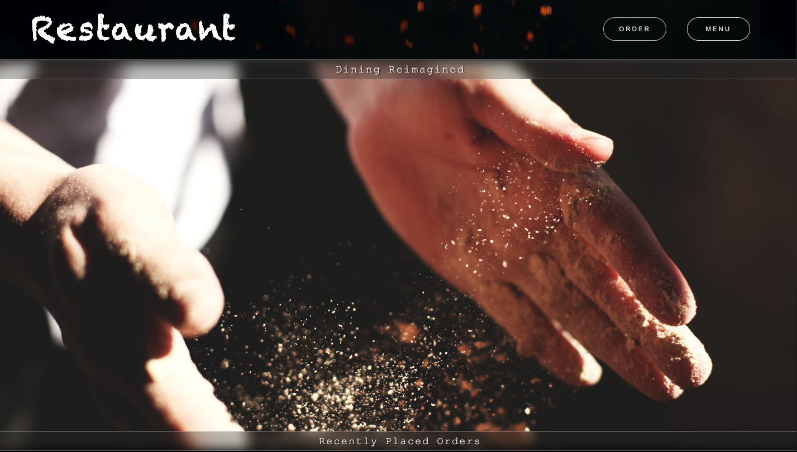
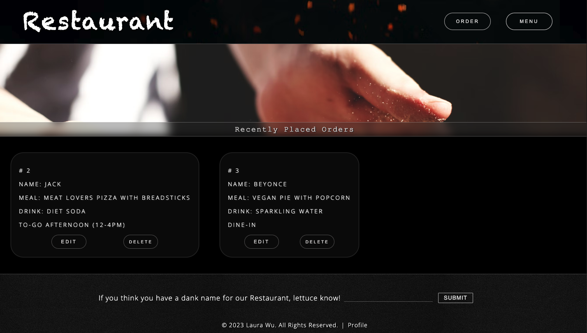

# Restaurant

Welcome to my Restaurant web app- where dining is reimagined. I’m a big foodie, so creating a website about food was really enjoyable. You can order any meal you'd like through Restaurant. There isn't a menu because the chefs are able to prepare anything you’d like. In my perfect world, this Restaurant would exist.

### Technologies Used
- Javascript
- HTML
- CSS
- axios
- Express
- cors
- JSON
- PostgreSQL
- Postman
- bit.io
- AWS
- GIT
- github

I named this eatery ‘Restaurant’, but if you think you have a better name, send it over! I’d love to hear your ideas. When you click submit, it sends your suggestion to my bit.io database with an axios post request. Using Sequelize, I made sure to sanitize all input fields. This footer is also on the home page.

